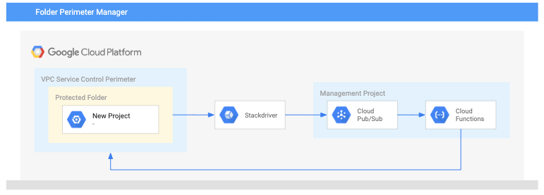

# Automatically Secured Folder

This example illustrates how to use Terraform and Cloud Functions to secure all projects within a folder via VPC service Controls.

Terraform is used to set up a new service perimeter and to deploy a Cloud Function which monitors that folder via Stackdriver and Cloud Pub/Sub. When the function notices a new project is added to the folder, it executes Terraform to add the new project to the associated perimeter. Similarly, the function automatically removes projects from the perimeter if they are moved out of the folder.



## Set up

**Please note, the whole example folder is uploaded as a Cloud Function. Do not store credentials in it.**

1. [Authenticate](https://www.terraform.io/docs/providers/google/provider_reference.html#credentials-1) to Terraform using either your user account or an exported Service Account key.

    ```bash
    export GOOGLE_APPLICATION_CREDENTIALS=~/mykey.json
    ```

    You will need these roles:

    - Access Context Manager Admin (`roles/accesscontextmanager.policyAdmin`)
    - Editor on the watched project (`roles/editor`)
    - Logs Configuration Writer on the watched folder (`roles/logging.configWriter`)

2. Choose or create a project for hosting the VPC Service Controls manager.

    ```bash
    gcloud config set project YOUR_PROJECT
    ```

3. Activate the required APIs on your management project:
    - cloudfunctions.googleapis.com
    - accesscontextmanager.googleapis.com
    - cloudresourcemanager.googleapis.com

    ```bash
    gcloud config set project YOUR_PROJECT
    gcloud services enable cloudresourcemanager.googleapis.com
    gcloud services enable cloudfunctions.googleapis.com
    gcloud services enable accesscontextmanager.googleapis.com
    ```

3. Create a Google Cloud Storage bucket to hold Terraform state.

    ```sh
    gsutil mb -p YOUR_PROJECT gs://YOUR_BUCKET_NAME
    ```

4. Copy `backend.tf.sample` to `backend.tf` and change the bucket to match your own on line 5.

    ```sh
    cp backend.tf.sample backend.tf
    ```

3. Create a local `terraform.tfvars` file with required inputs, like this:

    ```tf
    project_id          = "YOUR_PROJECT"
    org_id              = "ORG_ID"
    folder_id           = "FOLDER_ID"
    policy_name         = "automatic_folder"
    members             = ["user:YOUR_NAME@google.com"]
    region              = "us-east1"
    restricted_services = ["storage.googleapis.com"]
    ```

4. Run `terraform apply` to create the perimeter and watching function.

5. Grant the Cloud Function's SA access to your organization and management project. It needs these roles:

    - Access Context Manager Admin (`roles/accesscontextmanager.policyAdmin`)
    - Editor on the watched project (`roles/editor`)
    - Logs Configuration Writer on the watched folder (`roles/logging.configWriter`)

    ```bash
    SA_ID=$(terraform output function_service_account)
    ORG_ID=$(terraform output organization_id)
    PROJECT_ID=$(terraform output project_id)
    FOLDER_ID=$(terraform output folder_id)
    gcloud organizations add-iam-policy-binding \
        "${ORG_ID}" \
        --member="serviceAccount:${SA_ID}" \
        --role="roles/accesscontextmanager.policyAdmin"
    gcloud projects add-iam-policy-binding \
        "${PROJECT_ID}" \
        --member="serviceAccount:${SA_ID}" \
        --role="roles/editor"
    gcloud resource-manager folders add-iam-policy-binding \
        "${FOLDER_ID}" \
        --member="serviceAccount:${SA_ID}" \
        --role="roles/logging.configWriter"
    ```

6. Test the function by creating a project in the protected folder (or moving an existing project in).

## Limitations
1. The Cloud Function used to manage the perimeter must be hosted in a project **outside** the perimeter. This is because Cloud Functions do not yet support VPC Service Controls.
2. Nested folders are not supported. Only projects directly contained within your perimeter folder will be added.
3. See maximum number of projects per perimeter in https://cloud.google.com/vpc-service-controls/quotas.

<!-- BEGINNING OF PRE-COMMIT-TERRAFORM DOCS HOOK -->
## Inputs

| Name | Description | Type | Default | Required |
|------|-------------|:----:|:-----:|:-----:|
| folder\_id | Folder ID to watch for projects. | string | n/a | yes |
| members | An allowed list of members (users, service accounts). The signed-in identity originating the request must be a part of one of the provided members. If not specified, a request may come from any user (logged in/not logged in, etc.). Formats: user:{emailid}, serviceAccount:{emailid} | list(string) | n/a | yes |
| org\_id | The parent organization ID of this AccessPolicy in the Cloud Resource Hierarchy. | string | n/a | yes |
| perimeter\_name | Name of perimeter. | string | `"regular_perimeter"` | no |
| policy\_name | The policy's name. | string | n/a | yes |
| project\_id | The ID of the project to host the watcher function. | string | n/a | yes |
| region | The region in which resources will be applied. | string | n/a | yes |
| restricted\_services | List of services to restrict. | list(string) | n/a | yes |

## Outputs

| Name | Description |
|------|-------------|
| folder\_id | The ID of the watched folder. |
| function\_service\_account | Email of the watcher function's Service Account |
| organization\_id | Organization ID hosting the perimeter |
| policy\_name | Name of the parent policy |
| project\_id | The ID of the project hosting the watcher function. |
| protected\_project\_ids | Project ids of the projects INSIDE the regular service perimeter |

<!-- END OF PRE-COMMIT-TERRAFORM DOCS HOOK -->
